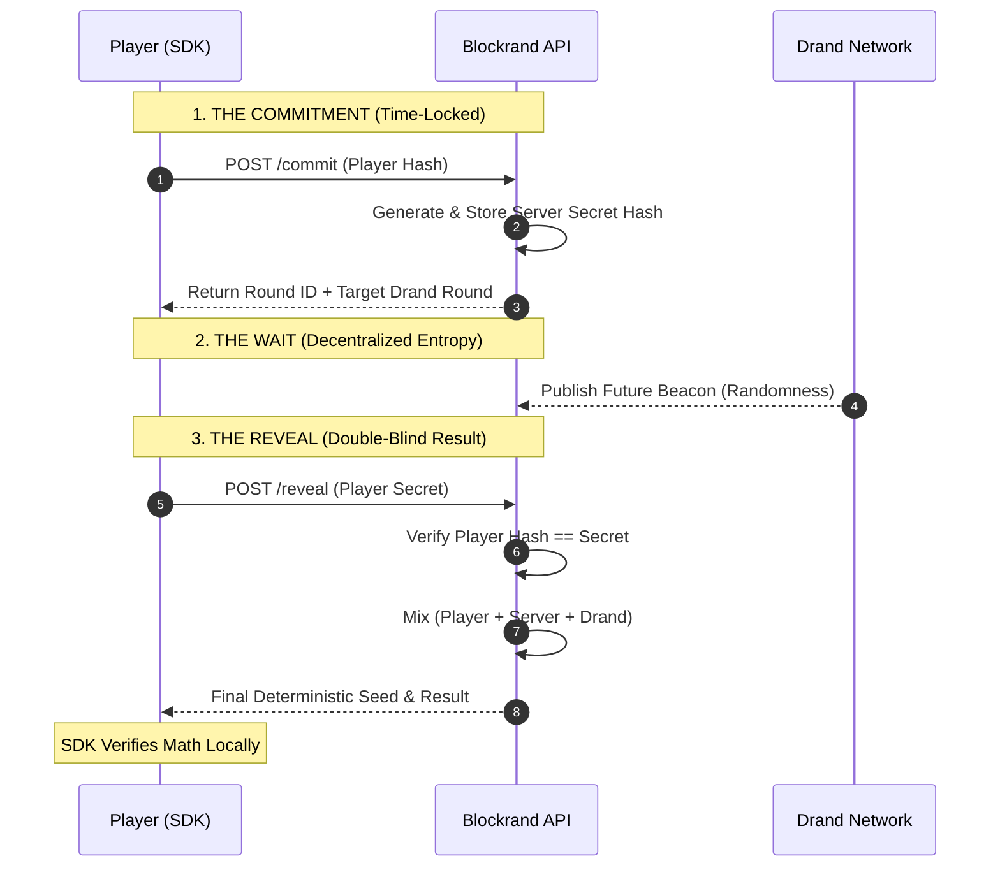

# blockrand.js

Javascript SDK to generate Provably fair, time-locked randomness using double-blind entropy and Drand using Blockrand API.

### Free Forever & Developer‑Friendly
Blockrand is designed to grow with you — without blocking you behind paywalls.

- 🆓 **Free Forever:** Up to 100 active players per month — no credit card.  
- 📦 **Open‑Source SDKs:** Transparent math, full code available.  
- 🔍 **Fully Verifiable:** Every result includes proof data for independent replay/verification.  
- 🎯 **Easy Integration:** Backend, web, or game clients with minimal setup.

---

## Overview

**Blockrand** is a provably fair randomness system based on **double-blind entropy** and **time-locked commitments**.

Randomness is generated using a strict **commit → settle → reveal** protocol where **neither the client nor the server can influence the outcome after commitment**, and the final entropy **does not exist at commit time**.

This JavaScript SDK provides a minimal, copy-paste interface for interacting with the Blockrand backend while preserving full cryptographic verifiability.

---

----

### Double-blind entropy

Each random result is derived from **three independent entropy sources**, none of which are known in full by any single party at commit time:

1. **Player secret** – generated locally and committed as a hash  
2. **Server secret** – generated server-side and committed as a hash  
3. **Drand beacon** – public, decentralized randomness revealed in a future round  

Because both the player and server commit *before* Drand is published, the system is **double-blind**:
- The player cannot bias the outcome
- The server cannot bias the outcome

---

### Time-locked randomness

Commitments are made against a **future Drand round**, allowing randomness to be time-locked **N seconds in advance**.

At commit time:
- The final random value is unknowable
- No party can precompute or discard outcomes
- All commitments are immutable

This prevents outcome fishing, retry abuse, and selective reveal attacks.

---

### Deterministic final seed

Once all inputs are revealed, the final seed is computed as:

SHA256(player_secret : server_secret : drand_signature)

Anyone can independently recompute this value and verify:
- Commit hashes
- Reveal integrity
- Drand round correctness
- Final outcome derivation

No trust in Blockrand is required.

---

## Get Your API Key

Blockrand uses Deterministic API Keys. Your key is generated based on your email and a secret hash, allowing you to recover your key mathematically if lost.

1. **Generate your Secret Hash**
In your terminal, create a SHA-256 hash of a strong password:

<pre>
echo -n "your_secret_you_would_remember" | shasum -a 256
</pre>

2. Run the following curl command to register and receive your br_ prefixed **API key**:

<pre>
curl -X POST https://api.blockrand.net/api/v1/register \
     -H "Content-Type: application/json" \
     -d '{
       "email": "your-email@example.com",
       "secret_hashed": "PASTE_YOUR_HASH_HERE"
     }'
</pre>

3. Important Notes
-  Deterministic Recovery: If you lose your API key, simply regenerate on bash using the same email and secret hash. If you are having any issue, write to us at rishi@blockrand.net
-  Storage: We store the secret_hashed to verify your identity, but we never see your original "your_secret_you_would_remember."

## Try out a sample

Once you have the API Key, you can simply test it by using the test.js file provided or write your own code like this:

<pre>
const br = new Blockrand("br_your_api_key_here");

const playerId = "user_123";
const delaySeconds = 6; // Standard Drand buffer

br.getRandom(playerId, delaySeconds, (res) => {
    if (res.error) {
        console.error("Game Error:", res.error);
        return;
    }

    console.log("Random Result (1-100):", res.fullResult.d100);
});
</pre>

If you want to see the big picture and behind the scenes of how everything is being delivered, you can run the test.js with the API Key and it will produce a result like this :

<pre>
  🚀 Running Blockrand SDK v1: Double-Blind Entropy...
[SDK] Commitment successful. Waiting 4.8s for reveal...

==================================================
             BLOCKRAND RESULTS TERMINAL             
==================================================

1️⃣  THE TRUST WINDOW (Provably Fair)
   Committed At : 2026-01-20T03:24:44.506877Z (Player input locked)
   Settled At   : 2026-01-20T03:24:49.10323Z (Randomness released)
   Verification : ✅ PASSED
   Note: Randomness was generated AFTER your commitment.

🛡️  THE DOUBLE-BLIND ENTROPY (Anti-Cheating)
   1. Player Blind: Player sent this Hash but kept the secret : a0647bfb59679d0850a94681c6c5b2d972cf396a9f46fdf5cda59ee18e1f7fa4
   2. Server Blind: Server sent this Hash but kept the secret : 8fd0ec3b71b35f4e5fe376d89a0e5bc5e1a96e1c7e67a778e05792626a6f3fe8
   3. Drand Blind: The dRand Beacon was generated AFTER you committed.

   Result: Total Neutrality. Player cannot cheat. The Server cannot cheat.

2️⃣  THE CRYPTOGRAPHIC MIX (The Formula)
   Formula      : Hash(player_secret + ':' + server_secret + ':' + drand_signature)
   Player Secret: fa5940246be8444cb1b6c565e9aed960 (Sent during Reveal)
   Server Secret: 744a89cf6511cfc6d0eaccebf228e411 (Released on Reveal)
   Drand Sig    : 922f7e7eb0ad50ab03f5d98c763ef88ae4f25b78beece3267b931d20b4585177f013b7e08e47d39c2543125582ef16a4 (External Entropy)
   Final Seed   : 4bbf8d26253a2fd72bff4e3eb09db2d6d543ce4bcfe355a24279fc38694d6655
   Explanation  : All secrets are now public. Any player can 
                  independently re-run the hash math to verify 
                  the seed matches the outcomes perfectly.

3️⃣  UNIFORM DERIVATION (How numbers are born)
   - D6 Result: 2
   - Logic    : We use 'Rejection Sampling'. If the seed bits
                create a bias, they are discarded and re-hashed.
                This ensures a perfect 16.66% chance for every face.

4️⃣  RESULTS SUMMARY
   🪙  Coin  : HEADS
   🎯  D100  : 66
   📈  Float : 0.53007666
   🃏  Cards : 21, 2, 13, 11, 18...

5️⃣  PUBLIC AUDIT
   Verify the beacon here:
   🔗 https://drand.cloudflare.com/52db9ba70e0cc0f6eaf7803dd07447a1f5477735fd3f661792ba94600c84e971/public/25358708
==================================================
</pre>

##  Audit

You can verify each outcome of every number generated:

- The base random seed is SHA256(player_secret + ":" + server_secret + ":" + drand_signature)

<pre>
echo -n "p_secret:s_secret:d_sig" | shasum -a 256
</pre>

- The audit url will give you the drand (public entropy) seed details. 
- The commit-reveal time will show that at the time of commit drand was not available and player and servers had each other's hashes but not the keys.
- All the random numbers generated can be determinisitically regenerated again using the same Seed. They can be verified independently by pure Mathematics

